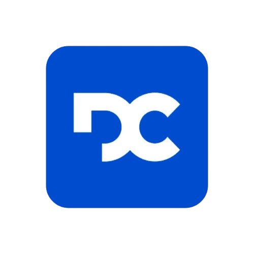

<h1 align="center">
  
  <br/>
  DoutorCash
</h1>

<p align="center">
  SaaS de gestão financeira pessoal com dashboard inteligente, controle de recorrências, metas e pagamento PIX integrado.
</p>

<p align="center">
  <a href="https://turbo-biz-funds-rje4.vercel.app">🔗 Demo ao vivo</a> &nbsp;·&nbsp;
  <a href="#-stack">Stack</a> &nbsp;·&nbsp;
  <a href="#-funcionalidades">Funcionalidades</a> &nbsp;·&nbsp;
  <a href="#-como-rodar">Como rodar</a>
</p>

---

## Visão geral

O **DoutorCash** é um aplicativo web SaaS voltado para controle financeiro pessoal. Usuários podem registrar transações, acompanhar metas de economia, gerenciar recorrências e visualizar relatórios de gastos por categoria e período.

O sistema possui dois perfis distintos: **usuário final** (plano pago via PIX) e **administrador** (gestão de clientes, planos e assinaturas).

---

## ✨ Funcionalidades

### Área do usuário
- **Dashboard** com cards de resumo, gráfico de gastos mensais, distribuição por categoria e comparativo mês a mês
- **Transações** — cadastro, edição e exclusão com categorização
- **Metas** — acompanhamento de progresso com valor atual vs. objetivo
- **Recorrências** — controle de despesas e receitas fixas com detalhamento por item
- **Cartões** — gestão de cartões de crédito/débito
- **Relatórios** — exportação e análise por período
- **WhatsApp** — integração para alertas e notificações
- **Configurações** — perfil, senha, tema claro/escuro e preferências

### Área administrativa
- Gestão de clientes e assinaturas
- Criação e edição de planos
- Categorias globais
- Relatórios consolidados
- Suporte e notificações

### Infraestrutura
- **PWA** — instalável, funciona offline com Service Worker
- **Pagamento PIX** via SDK EFI (Gerencianet) com fluxo de ativação de plano
- **Auth completa** — login, cadastro, recuperação e redefinição de senha
- **RBAC** — rotas protegidas por papel (user/admin) e por plano ativo
- **i18n** — internacionalização preparada
- **LGPD** — conformidade com legislação brasileira de dados

---

## 🛠 Stack

| Camada | Tecnologia |
|--------|-----------|
| Framework | React 18 + TypeScript |
| Build | Vite 5 |
| Estilização | Tailwind CSS + shadcn/ui (Radix) |
| State / Server | TanStack Query v5 |
| Formulários | React Hook Form + Zod |
| Roteamento | React Router v6 (lazy + retry) |
| Gráficos | Recharts |
| Pagamentos | SDK EFI (PIX) |
| PWA | vite-plugin-pwa + Workbox |
| Testes | Vitest + Playwright + axe-core |
| CI local | Husky + lint-staged |
| Deploy | Vercel + Vercel Analytics |

---

## 📁 Estrutura do projeto

```
src/
├── features/          # Módulos por domínio (dashboard, transactions, goals…)
│   ├── auth/
│   ├── dashboard/
│   ├── transactions/
│   ├── goals/
│   ├── recurrences/
│   ├── payments/
│   ├── plans/
│   └── admin/
├── pages/             # Páginas roteadas
├── layouts/           # UserLayout / AdminLayout
├── contexts/          # AuthContext
├── hooks/             # Hooks globais reutilizáveis
├── lib/               # Utils, i18n, analytics, performance
└── shared/            # Tipos compartilhados
```

---

## 🚀 Como rodar

### Pré-requisitos
- Node.js 18+
- npm ou bun

### Instalação

```bash
# Clone o repositório
git clone https://github.com/morgadothiago/turbo-biz-funds.git
cd turbo-biz-funds

# Instale as dependências
npm install

# Configure as variáveis de ambiente
cp .env.example .env
# Edite .env com suas credenciais

# Inicie o servidor de desenvolvimento
npm run dev
```

### Comandos disponíveis

```bash
npm run dev           # Dev server
npm run build         # Build de produção
npm run test          # Testes unitários (Vitest)
npm run test:e2e      # Testes E2E (Playwright)
npm run test:coverage # Cobertura de testes
npm run storybook     # Storybook de componentes
npm run lint          # ESLint
```

---

## 🔐 Variáveis de ambiente

```env
VITE_API_URL=          # URL da API backend
VITE_EFI_CLIENT_ID=    # Credencial EFI (PIX)
VITE_EFI_CLIENT_SECRET=
```

Consulte `.env.example` para a lista completa.

---

## 📄 Licença

Projeto proprietário — todos os direitos reservados.

---

<p align="center">Desenvolvido por <a href="https://github.com/morgadothiago">Thiago Morgado</a></p>
