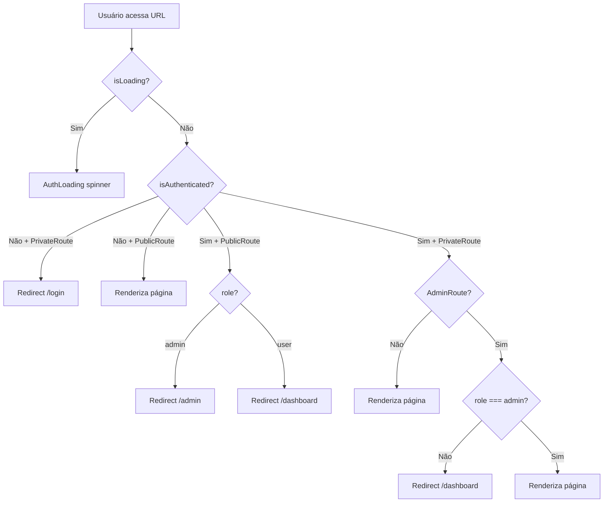

# Sistema de Guards (Proteção de Rotas)

## Visão Geral

O sistema usa 3 guards baseados no estado do `AuthContext`:

```
PublicRoute    → rotas sem autenticação (landing, login, cadastro)
PrivateRoute   → rotas que exigem login
AdminRoute     → rotas que exigem login + role === "admin"
```

## `PublicRoute`

**Comportamento:**
- Usuário autenticado com `role === "admin"` → redireciona para `/admin`
- Usuário autenticado com `role === "user"` → redireciona para `/dashboard`
- Usuário não autenticado → renderiza a rota normalmente

**Usado em:** `/`, `/login`, `/cadastro`, `/recuperar-senha`, `/redefinir-senha`

## `PrivateRoute`

**Comportamento:**
- Usuário não autenticado → redireciona para `/login`
- Usuário autenticado → renderiza a rota normalmente

**Usado em:** Todas as rotas `/dashboard/*`

## `AdminRoute`

**Comportamento:**
- Usuário não autenticado → redireciona para `/login`
- Usuário autenticado mas sem `role === "admin"` → redireciona para `/dashboard`
- Admin autenticado → renderiza a rota normalmente

**Usado em:** Todas as rotas `/admin/*`

## Estado de Loading

Durante a verificação do token (restore do localStorage), o estado `isLoading` do `AuthContext` está `true`. Nesse período, os guards renderizam `<AuthLoading />` (spinner) para evitar redirecionamentos prematuros.

## Fluxo Completo



---

Veja também: [[../06-Estado-e-Hooks/AuthContext]] | [[Rotas Públicas]] | [[Rotas Dashboard]] | [[Rotas Admin]]
